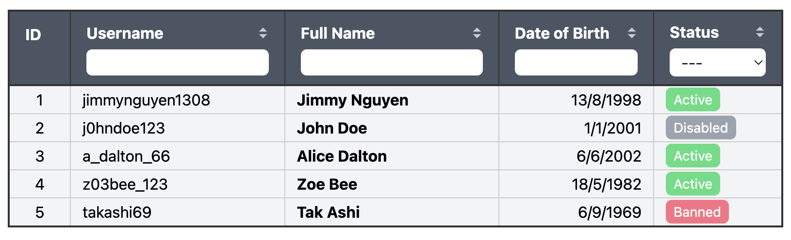
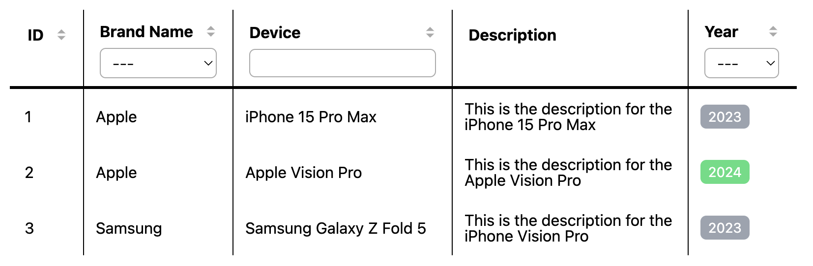

# Qwik-table-loader Examples

  

By [`@jimmynguyen1308`](https://github.com/jimmynguyen1308)

## Example 1

Click [here](example1.tsx) to see code

### Screenshot

## Example 2

Click [here](example2.tsx) to see code

### Screenshot

